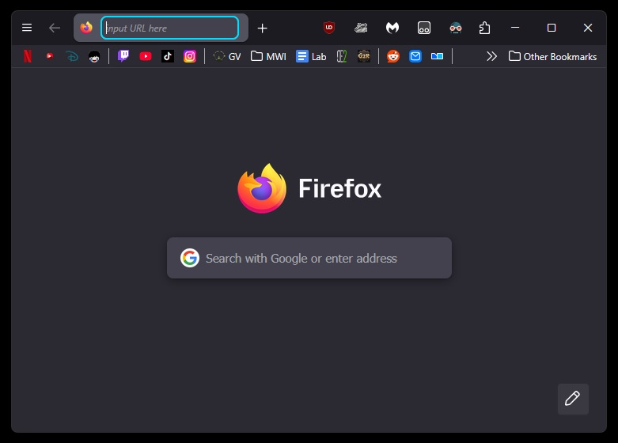
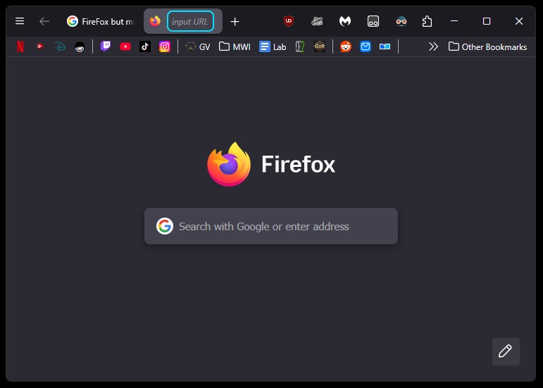
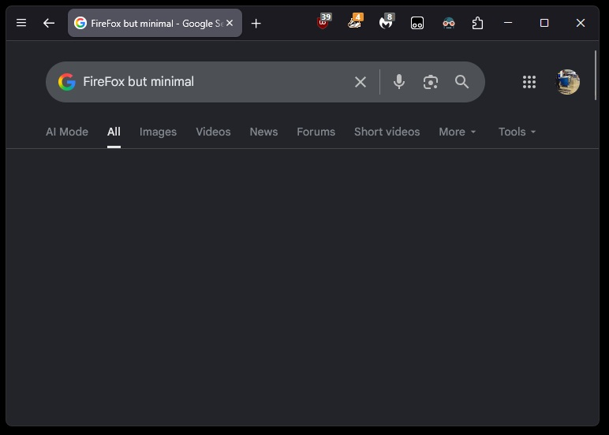
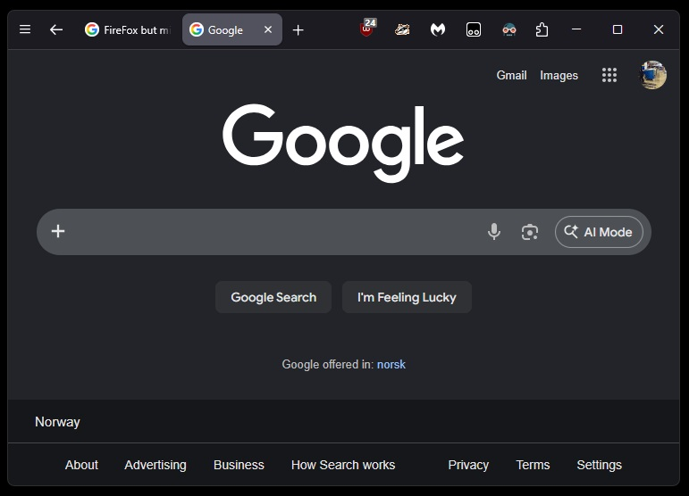

# FireFox-compact-mode

A minimal, compact Firefox setup that merges the tab bar and nav bar into a single row, with inline URL editing on tabs.

## Demo Screenshots

### Startup View

### New Tab Behavior

### Tab Search

### Bookmarks Hidden on Load

## Features

- **Single-row layout** — app menu and back button on the left, tabs in the middle, extensions and window controls on the right. No separate nav bar taking up vertical space.
- **Inline URL editing** — double-click any tab to edit its URL in place, with live autocomplete from your browsing history.
- **Smart new tabs** — opening a new blank tab drops you straight into the inline URL editor, no address bar needed.

## Requirements

- **Firefox 115+** (tested on Firefox 150.0.3, 64-bit)
- **[fx-autoconfig](https://github.com/MrOtherGuy/fx-autoconfig)** installed — this is what enables custom user scripts (`.uc.js`) and the `chrome/` folder. Follow its install instructions before proceeding.

## Installation

### 1. Install fx-autoconfig

Follow the instructions at [MrOtherGuy/fx-autoconfig](https://github.com/MrOtherGuy/fx-autoconfig). In short:

- Copy `config.js` and the `defaults/` folder into your **Firefox install directory**
  (e.g. `C:\Program Files\Mozilla Firefox\`)
- Copy the `chrome/utils/` folder into your **Firefox profile folder**
  (find it at `about:support` → **Open Folder** next to "Profile Folder")

### 2. Copy the files from this repo

| File in this repo | Copy to |
|---|---|
| `install/channel-prefs.js` | `<Firefox install dir>/defaults/pref/channel-prefs.js` *(overwrite)* |
| `install/userChrome.css` | `<Profile folder>/chrome/userChrome.css` |
| `install/tab-edit-url.uc.js` | `<Profile folder>/chrome/JS/tab-edit-url.uc.js` |
| `install/extensions-to-tabbar.uc.js` | `<Profile folder>/chrome/JS/extensions-to-tabbar.uc.js` |

> Create the `chrome/` and `chrome/JS/` folders inside your profile if they don't exist.

### 3. Restart Firefox

Fully close Firefox (check Task Manager — no lingering `firefox.exe` processes) and reopen it. The layout should snap into place and double-clicking a tab should open the inline URL editor.

## Usage

- **Double-click a tab** → edit its URL inline, with history autocomplete.
- **Open a new tab** → jumps straight into the inline URL editor.
- **Arrow keys** → navigate autocomplete suggestions.
- **Tab** → fill the input with the selected suggestion.
- **Enter** → navigate (URL, domain, or Google search for plain text).
- **Esc** or click outside → cancel.

## Troubleshooting

**Scripts aren't loading after a Firefox update.**
Firefox updates can overwrite `defaults/pref/channel-prefs.js`, wiping the fx-autoconfig prefs. If your scripts stop working after an update, just re-copy `install/channel-prefs.js` from this repo and restart Firefox.

**Nothing loads at all.**
- Make sure Firefox is **fully** closed before copying files (no `firefox.exe` in Task Manager).
- Verify `chrome/utils/` from fx-autoconfig is in your **profile** folder, not the install folder.
- Check `about:config` for `xpinstall.signatures.required` — if it's `false`, the prefs loaded correctly.
- Open the Browser Console (Ctrl+Shift+J) and look for red errors.

**Layout looks wrong.**
Your Firefox version might have renamed some toolbar elements. Open an issue with a screenshot.

## Files

- `install/channel-prefs.js` — Firefox prefs that enable fx-autoconfig and legacy customization (`userChrome.css`, unsigned extensions, experiments).
- `install/userChrome.css` — CSS that hides the nav bar and shapes the compact layout.
- `install/tab-edit-url.uc.js` — Inline tab URL editor with history autocomplete.
- `install/extensions-to-tabbar.uc.js` — Rearranges app menu, back button, extensions, and window controls into the tab bar.

## Credits

Built on top of [MrOtherGuy/fx-autoconfig](https://github.com/MrOtherGuy/fx-autoconfig).

## License

[MIT](LICENSE)
